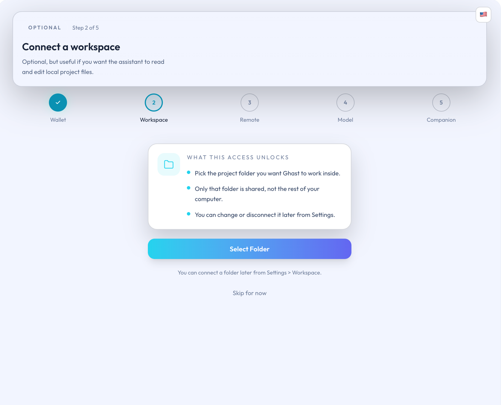

# Connect a Workspace

This page outlines when to connect a workspace, what the connection means, and safer practices for regular users.

## Overview

This page clarifies when a workspace connection is needed, what it does for you, and how ordinary users can keep the connected directory as a focused boundary.

## When to connect one

Decide whether to connect a workspace based on your usage scenario:

| Use case | Recommended now? |
| --- | --- |
| Chatting, reading webpages, organizing memories, managing wallets, or otherwise using basic capabilities | Not necessary yet |
| Needing Ghast AI to read or write local project files or documentation | Yes |
| Running local commands against a repository | Yes |
| Preparing to use MCP Servers, Code Agents, ACP, or other stronger local capabilities | Yes |

If your current activity does not involve local files or commands, you can postpone this step until you are ready to work within a specific directory.

## Before you connect

Before connecting a workspace, confirm:

1. Companion is installed and the extension recognizes it.
2. The issue is not that the installer was blocked by the OS or that Companion has not completed pairing.
3. You are keeping the connection in `workspace` mode rather than immediately switching to `full`.
4. You know which project directory, repository, or document folder you want to work with.

If the first two items are not yet true, return to the installation, detection, or connection page before requesting workspace access.

## What a workspace means

A workspace means you deliberately choose a local folder and let Ghast AI operate within that folder. This step is not an extra configuration; it is the natural boundary between local capabilities and the rest of your machine.

Focus on these distinctions:

| Correct understanding | Incorrect assumptions |
| --- | --- |
| You select a folder for AI to read and write within your project | You are opening the entire computer |
| Authorization initially applies only to the folder you chose | You never need to manage it after connecting |
| You can change, reauthorize, or disconnect the directory later | You must connect everything from the start |

For ordinary users, the workspace connection is the default starting boundary for using Ghast AI locally.

## Recommended approach

Keep the first connection within the directory you are actually working on:

1. Prefer the current project root, repository folder, or document directory you are handling right now.
2. Do not connect broader locations like Desktop, Downloads, or your home directory unless the task requires it.
3. Add or switch workspaces later when you take on another project or need a different directory.
4. If you only want to complete a basic experience first, you can connect a folder later under **Settings > Companion > Workspace**.

This sequence helps Ghast AI start within a clear project boundary instead of granting a wide local scope immediately.

## After you connect

After a successful connection, you can expect:

- The page indicates the workspace is connected.
- Local file capabilities focus on that directory.
- When using local commands, MCP, or Code Agents, that workspace becomes the natural starting scope.

If your work stays within that folder, there is usually no need to switch to `full` for the sake of broader capabilities.

## If it stops working

When a previously connected workspace no longer works, treat it as a reauthorization or reconnection step:

| Common situation | Recommended response |
| --- | --- |
| Browser reports the permission expired or asks for reauthorization | Re-select the same folder and complete authorization again |
| The project folder moved, was renamed, or is now on an external disk | Reconnect the directory you actually use |
| You switched to a different project | Switch workspaces or disconnect and connect the new directory |
| The directory is still narrow but you want to keep a focused boundary | Add or adjust workspace bounds before jumping to `full` |

Workspace failures typically mean you need to reauthorize or reconnect, not immediately open the entire machine.

For regular users, a workspace is the default boundary for accessing local capabilities. The standard approach is to connect the directory you actually need, keep the permission on that folder, and only broaden or switch boundaries as the work demands.

## Related pages

- [Install Companion](../start-here/install-companion.md)
- [Install and Auto-Pair](install-and-auto-pair.md)
- [Companion Connection Issues](../troubleshooting/companion-connection.md)
