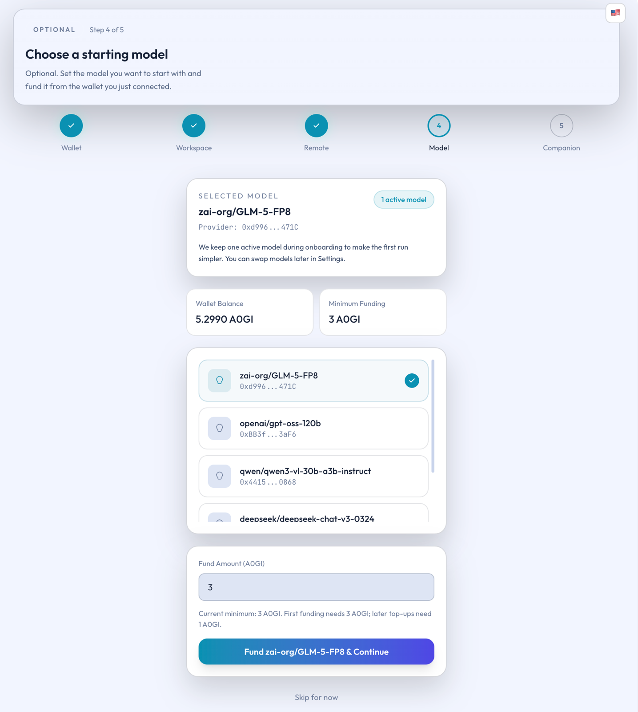

# Models and Funding

## Overview

This page explains how Ghast AI treats models and model funding, when you need to add funds or request refunds, and which balances are most important to check.

## One key distinction

Wallet balance and model-available funds are not the same thing. For most users:

- The wallet is your local source of funds.
- The model page shows the funds that have been prepared for that model.
- Seeing a balance on the model page does not mean it is the wallet's master balance.

*Figure: Model selection and initial funding page*

Understanding those layers makes later recharge and refund decisions much easier.

## What this page does

The model page currently serves three main purposes:

- Select the model you intend to use.
- Check the available funding for that model.
- Perform recharge and refund operations.

It is therefore more of a model-management page than a simple balance display.

## First visit

If this is your first time here, follow this order:

1. Pick the model you plan to enable.
2. Check whether that model already has available funds.
3. If not, recharge the model.
4. After you start using it, decide whether to add more funds based on consumption.

This approach keeps you focused on one model instead of topping up many at once.

## What to check

For most users, focus on the current layer you are working with:

- What is in your wallet.
- What is available to the model.
- What portion is currently eligible for refund.

It is normal for a model to ask for more funds even when your wallet has money, because they are tracked separately. Likewise, a small refundable amount after a recent recharge is not necessarily a problem.

## Recommended routine

To keep things simple and stable:

1. Enable one primary model first.
2. Make sure that model has enough funds to start.
3. Use it for a while before deciding to switch or add more.
4. Treat the model's funding status as distinct from the wallet balance.

Ghast AI's model page is the place to manage model choice and funding, not to display wallet balance. For most users, the recommended path is to enable one primary model, prepare the basic available funds for it, and then adjust gradually based on actual usage.

## Related pages

- [Wallet Setup](wallet-setup.md)
- [Wallet and funding issues](../troubleshooting/wallet-and-funding.md)
