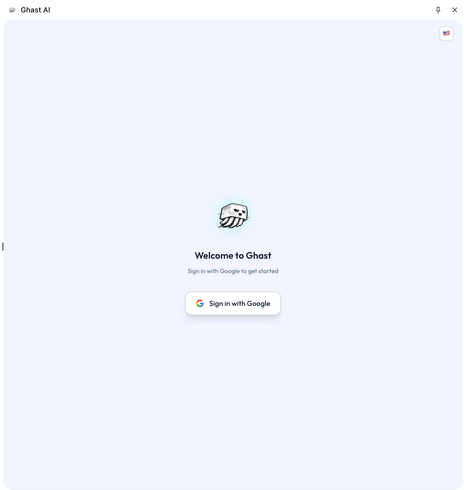
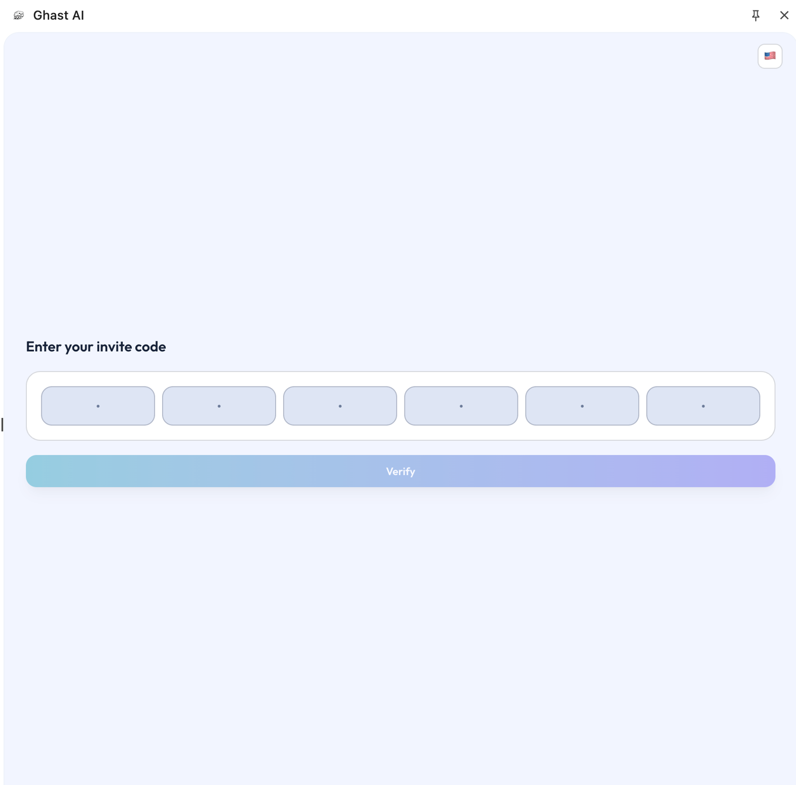

# Sign In and Activation

## Overview

Signing in and activation form two connected steps for your first use of Ghast AI. This page clarifies what each step means, what you should expect to see on the normal path, and when to treat a screen as a genuine issue.

## Two steps

| Step | What it means for most users |
| --- | --- |
| Sign in | Confirms which account you are using |
| Activation | Confirms the account is ready to use normally |

Completing sign-in does not automatically mean you are in the full interface.

## Standard path

When you open the extension for the first time, you usually land on the Google sign-in page.

*Figure: Google sign-in page*

The normal order for most users is:

1. Complete the Google sign-in.
2. If prompted, move on to the activation step.
3. Only after both sign-in and activation finish are you in regular use mode.

## Why you may still see the invite code

The invite-code step is part of the formal activation path for some accounts and is not inherently an error. If your account has not been activated yet, you may still see the invite-code page immediately after signing in.

*Figure: Invite code input page*

This simply means the process has not finished, not that sign-in failed.

## When this step is complete

For most users, you can consider sign-in and activation done only when all of the following are true:

- Google sign-in is complete.
- If your account needs an invite, activation has finished.
- You have left the sign-in or invite-code screen and moved on to the follow-up guidance or main interface.

Finishing only the first item is not enough to treat this step as complete.

## Avoid these assumptions

Avoid these premature conclusions:

- Don't equate successful sign-in with immediate full access.
- Don't assume the invite-code screen means the product is broken.
- Don't mix later wallet, model, or Companion issues into activation troubleshooting before activation itself is done.

## If it still fails

If you repeat sign-in, confirm the invite code, and still cannot reach the normal interface, then the troubleshooting guides are the right place to go next.

Ghast AI sees sign-in and activation as two distinct but sequential steps. Sign-in confirms the account identity, while activation confirms the account can enter full use. The invite-code step is part of activation for some accounts, not simply an error page.

## Related pages

- [Install the extension](install-extension.md)
- [Quickstart](../start-here/quickstart.md)
- [Sign-in and activation issues](../troubleshooting/login-and-activation.md)
