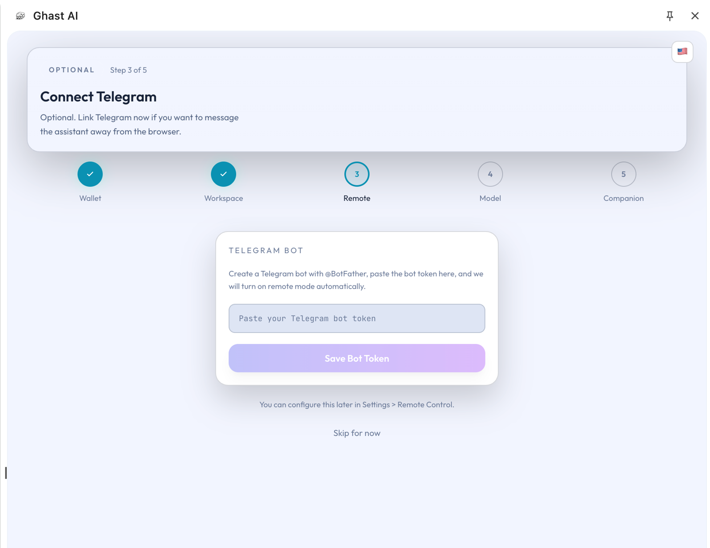
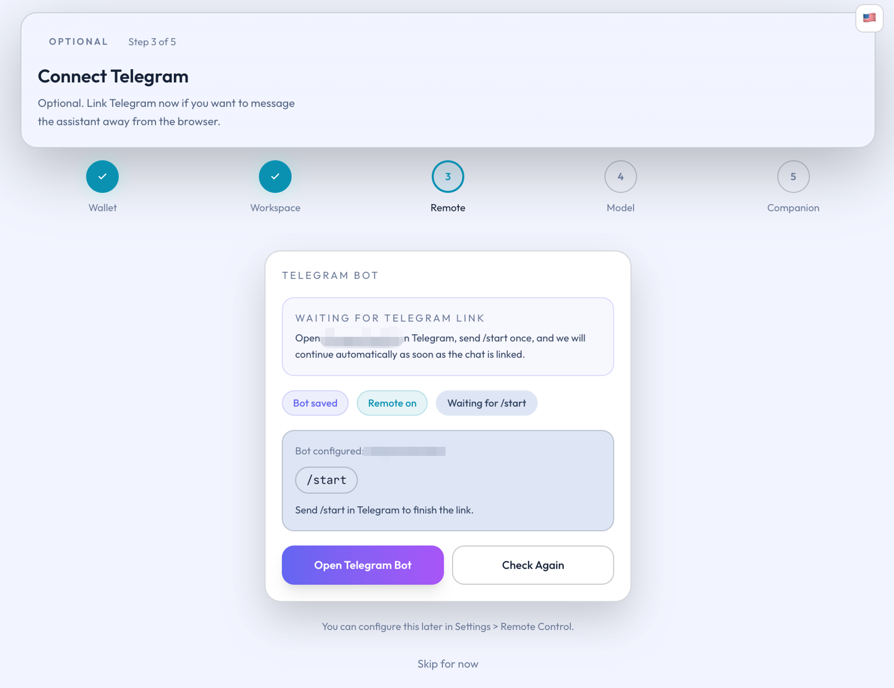

# Telegram Setup

## Overview

This page explains how to use Telegram as Ghast AI's remote entry point, and what order ordinary users should follow when setting it up for the first time.

## Decide whether you need this page first

The Telegram remote path is better suited to situations like these:

- You want to keep reaching Ghast AI through Telegram after leaving the browser.
- The extension's main usage path is already working and you are ready to enter the remote-use stage.
- You accept that a remote entry point adds extra approvals and boundary controls.

If you are still mainly using Ghast AI through the browser sidebar, this page is usually not a priority.

## What to confirm before starting

Before configuring Telegram, confirm the following:

1. The extension is installed, signed in, and fully activated.
2. You understand that remote control is an optional extra entry point.
3. You are ready to use your own Telegram Bot Token.

If those conditions are not in place yet, return to the main product path before opening a remote channel.

## Standard setup order

The steadier setup order is:

1. Open `Settings > Remote`.
2. In Telegram, use `@BotFather` to create a personal bot and obtain a Bot Token.
3. Paste the token into the extension and save it, then wait for the extension to recognize the bot username.

The interface looks like this:

*Figure: Telegram Bot Token setup screen*

4. Open the bot in Telegram and send `/start` once.
5. Return to the extension and confirm that the chat has been linked; use recheck if needed.

The link state looks like this:

*Figure: Telegram chat link waiting state*

## What counts as complete setup

For ordinary users, the Telegram path should only be treated as complete when all of the following are true:

- The Bot Token has been saved.
- The extension has recognized the correct bot username.
- The Telegram chat has been linked.
- You can enable remote mode when needed.

If only the first two steps are complete, the remote path is usually not live yet.

## Why it can look configured but still not work

The most common explanation is not a product fault. It is that the setup is still at the stage where the bot has been saved but the chat has not been linked.

The practical interpretation is simple:

- Saving the token does not mean the remote entry point is already usable.
- Telegram only becomes a usable remote channel after the chat link is complete.

Telegram is currently Ghast AI's main remote entry point for ordinary users. It is best understood as an optional operating channel that becomes a formal remote path only after bot setup and chat linking are both complete.

## Related pages

- [Remote Control Model](../core-concepts/remote-control-model.md)
- [Approval Flow](approval-flow.md)
- [Provenance and Actor](provenance-and-actor.md)
- [Remote Channel Status Reference](../reference/remote-channel-status-reference.md)
