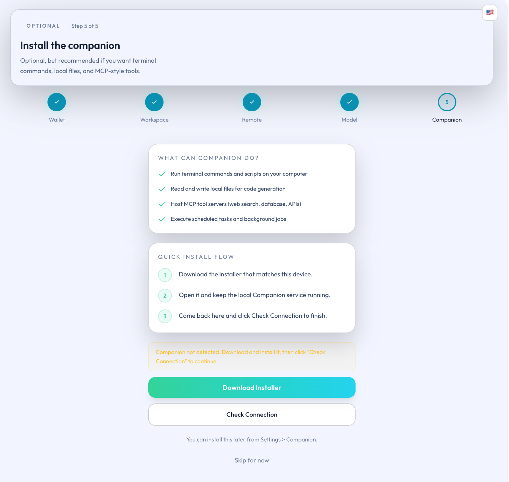

# Install Companion

## Overview

This page explains when to install Companion, how to install it, and how to handle system security prompts during setup.

## When to install it

Continue with the extension only if your needs are limited to chat, page understanding, memory, skills, wallet, or basic model usage.

Install Companion when your goals include:

- Connecting a workspace.
- Accessing stronger local capabilities.
- Entering deeper automation workflows.
- Using a fuller local assistant experience.

## Installation method

Companion is distributed through the official Releases page as an installer package. There is no need to install it through the terminal.

- Download page: [Trapezohe Companion Releases](https://github.com/Trapezohe/companion_service/releases)
- macOS installer: `trapezohe-companion-macos.pkg`
- Windows installer: `trapezohe-companion-windows.msi`
- Checksum file: `SHA256SUMS.txt`

*Figure: Companion installation guide screen*

## Verify the download

Follow this sequence before installing:

1. Download the installer only from the official Releases page.
2. Verify the package digest against `SHA256SUMS.txt`.
3. Proceed with installation only after source and checksum are confirmed.

Do not continue if the source cannot be verified or the checksum does not match.

## System security prompts

The installers currently lack code signing, so macOS and Windows may warn about potential risks. These prompts are expected when the download origin is trusted.

Confirm both below before proceeding:

- The installer is from the official Releases page.
- The checksum matches `SHA256SUMS.txt`.

Then follow the guidance for each platform:

| Operating system | Common prompt | Recommended action |
| --- | --- | --- |
| macOS | Gatekeeper reports an unidentified developer or blocks opening the installer | After confirming origin and checksum, go to System Settings > Privacy & Security, allow this install, and reopen the package. |
| Windows | SmartScreen displays "Windows protected your PC" | After confirming origin and checksum, expand "More info" and continue only when the publisher is trusted. |

If the source cannot be verified, or you are unsure whether to continue, stop the installation.

## After installation

1. Return to the Companion page inside the extension.
2. Confirm that the extension detects the local Companion instance.
3. Once detection succeeds, begin with the default, more conservative local boundaries.

Most users do not need to handle low-level connection details during their first installation.

Companion is the local capability layer for Ghast AI. The standard path is to download the package from the official Releases page, verify the checksum, and then rely on the extension's automatic detection and default conservative boundaries.

## Related pages

- [Install and Auto-Pair](/en/companion/install-and-auto-pair)
- [Connect a Workspace](/en/companion/connect-a-workspace)
- [Companion Connection Issues](/en/troubleshooting/companion-connection)
