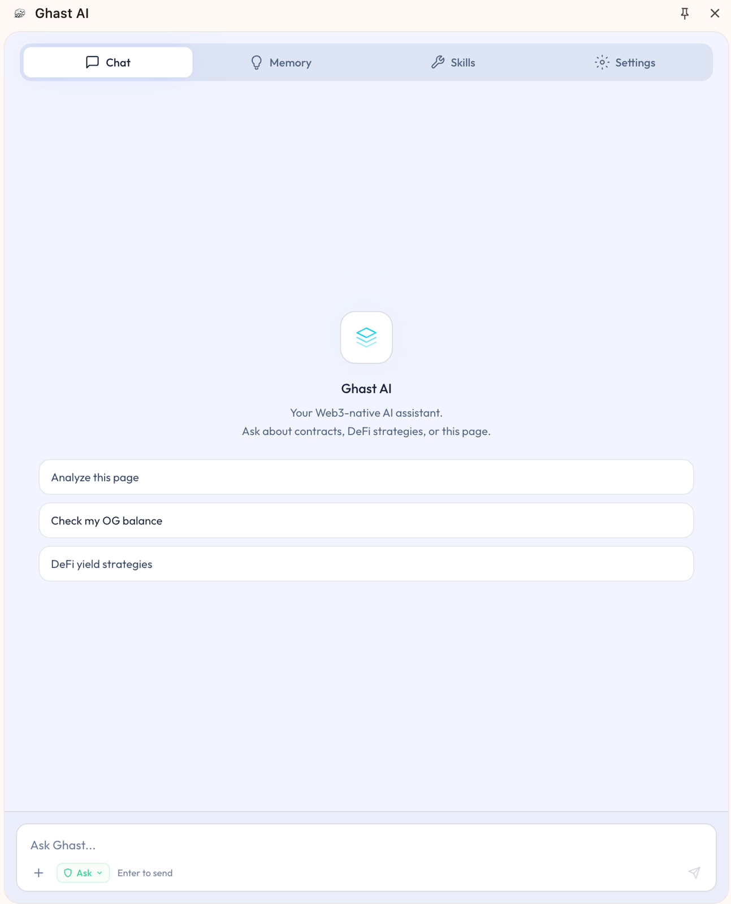

# What Is Ghast AI

## Overview

This page explains what Ghast AI is, where users start, and how to understand the product on first use.

## What Ghast AI is

For most users, Ghast AI is best understood as an AI assistant centered on the Chrome sidebar that can connect to local capabilities when needed. It is not just a chat window, and it is not an always-open automation tool for the whole machine. The standard path is:

- Chatting and working with web content from the sidebar.
- Managing memory, skills, wallet, and model selections.
- Connecting Companion only when workspace features or stronger local capabilities are explicitly needed.

## Primary entry point

Daily usage begins in the browser sidebar chat interface.

*Figure: The main sidebar view*

This is where most users begin using Ghast AI.

## What you can do

The current standard usage paths include:

- Holding daily conversations inside the sidebar.
- Working with supported pages by combining chat with page context.
- Managing long-term memory and skills.
- Creating or importing a local wallet.
- Selecting models and managing model credits.
- Connecting Companion on demand to access workspaces and stronger local capabilities.

## Recommended order

1. Install the extension.
2. Complete sign-in and activation.
3. Set up wallet and model basics.
4. Verify the sidebar chat and page-context usage flow.
5. Install Companion only when workspace or deeper local capabilities are required.

## When to add Companion

| Your need | Recommended path |
| --- | --- |
| Chat, page understanding, memory, skills, wallet, or basic model usage | Continue using the extension only |
| Workspace access, stronger local commands, deeper automation, or a fuller local assistant experience | Connect Companion afterward |

This split keeps the main path simple before adding heavier local capability flows.

## What it is not

Avoid interpreting Ghast AI as:

- A standalone desktop IDE.
- A browser-spanning automation tool that takes over everything by default.
- A product that grants all local capabilities immediately upon installation.

Ghast AI is an AI assistant that runs in the Chrome sidebar. The extension is the primary entry point, and Companion adds local capabilities when they are needed.

## Related pages

- [Quickstart](/en/start-here/quickstart)
- [Install Companion](/en/start-here/install-companion)
- [Install the Extension](/en/extension/install-extension)
- [Security Overview](/en/security/overview)
