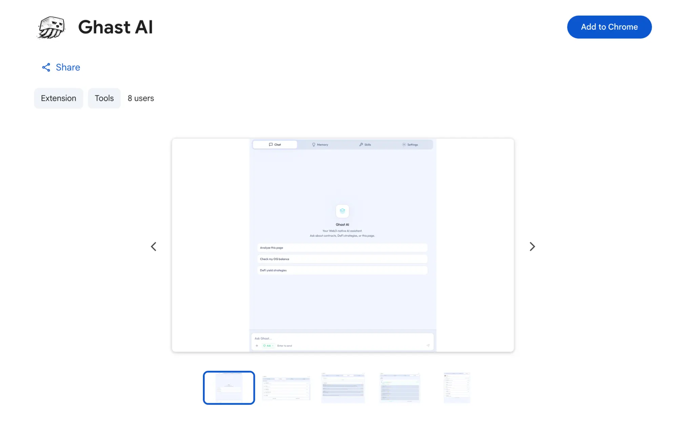

# 安装扩展

## 本页说明

本页说明 Ghast AI 扩展的标准安装入口、安装完成后的正常路径，以及第一次安装时不需要急着处理的事项。

## 标准安装入口

Ghast AI 当前面向普通用户的标准安装入口，是 Chrome Web Store：

- [Ghast AI - Chrome Web Store](https://chromewebstore.google.com/detail/ghast-ai/nnhdkkgpoeojjddikcjadgpkbfbjhcal)

对应界面如下：

*图：扩展安装入口*

只要从这个入口完成安装，就已经进入正式上手路径。

## 安装完成后通常会发生什么

第一次安装完成后，正常顺序通常是：

1. 打开浏览器侧边栏中的 Ghast AI。
2. 先完成登录。
3. 如果当前账号还需要激活，就继续完成邀请码步骤。
4. 再进入钱包、模型、工作区等后续引导。

也就是说，安装扩展只是入口，不等于第一次使用已经全部完成。

## 只安装扩展时已经可以做什么

即使还没有安装 Companion，你也已经可以开始使用下面这些能力：

- 聊天
- 页面理解
- 记忆管理
- 技能管理
- 钱包和模型基础设置

如果你后续需要工作区、本地命令或更强的本地能力，再继续安装 Companion 即可。

## 第一次安装时不需要急着做什么

第一次安装扩展时，不需要一开始就把所有高级能力都配置完。

更稳妥的顺序是：

1. 先完成登录与激活。
2. 先完成钱包和模型基础路径。
3. 先把侧边栏里的基础使用跑通。
4. 只有在明确需要本地能力时，再继续接入 Companion。

Ghast AI 当前的主入口是 Chrome 扩展。对普通用户而言，标准路径是先从 Chrome Web Store 完成安装，再按顺序完成登录、激活和基础设置；更深入的本地能力应在明确需要时，通过 Companion 继续接入。

## 相关页面

- [快速开始](../start-here/quickstart.md)
- [登录与激活](sign-in-and-activation.md)
- [钱包设置](wallet-setup.md)
- [安装 Companion](../start-here/install-companion.md)
