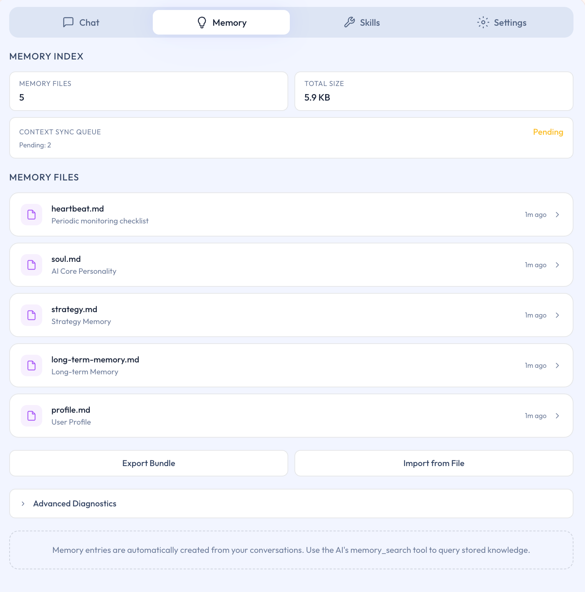

# Memory 页面

## 本页说明

Memory 页面是 Ghast AI 管理长期上下文的标准入口。本页说明这页适合做什么、第一次进入时应先看什么，以及为什么它不应被当成普通工作区文件页来理解。

## 这页主要负责什么

对普通用户来说，Memory 页面主要负责下面三类事情：

- 查看当前的核心记忆内容。
- 导入或导出长期记忆。
- 判断记忆同步和当前状态是否正常。

对应界面如下：

*图：Memory 页面*

因此，这一页更适合被理解为长期上下文管理页，而不是普通文件浏览页。

## 第一次进入时，建议先看什么

如果你是第一次打开这页，更推荐先关注：

- 当前已经有哪些核心记忆。
- 是否存在你希望长期保留的重要信息。
- 是否真的需要做导入或导出。

页面中更深的同步、差异和状态信息，可以在真正需要排查问题时再看，不必一开始就全部理解。

## 为什么它不是工作区文件页

对普通用户来说，最重要的区分是：

- 工作区文件属于你主动连接的本地目录。
- Memory 页面管理的是 Ghast AI 自己的长期上下文层。

这也是为什么它有独立入口，而不是放在普通工作区路径里处理。

## 导入、导出和同步该怎么理解

这三类操作更适合在下面这些情况下再使用：

- 你需要备份长期记忆。
- 你需要迁移或恢复一部分记忆内容。
- 你正在处理记忆同步或状态异常。

如果只是日常使用，不需要频繁操作这部分功能。

Memory 页面是 Ghast AI 当前管理长期上下文的主入口。对普通用户而言，更适合优先把它用于查看、整理、导入和导出长期记忆；页面中的更深入状态信息，应在排查或进阶使用时再关注。

## 相关页面

- [记忆模型](../core-concepts/memory-model.md)
- [数据存储与同步边界](../security/data-storage-and-sync.md)
- [记忆文件参考](../reference/memory-file-reference.md)
