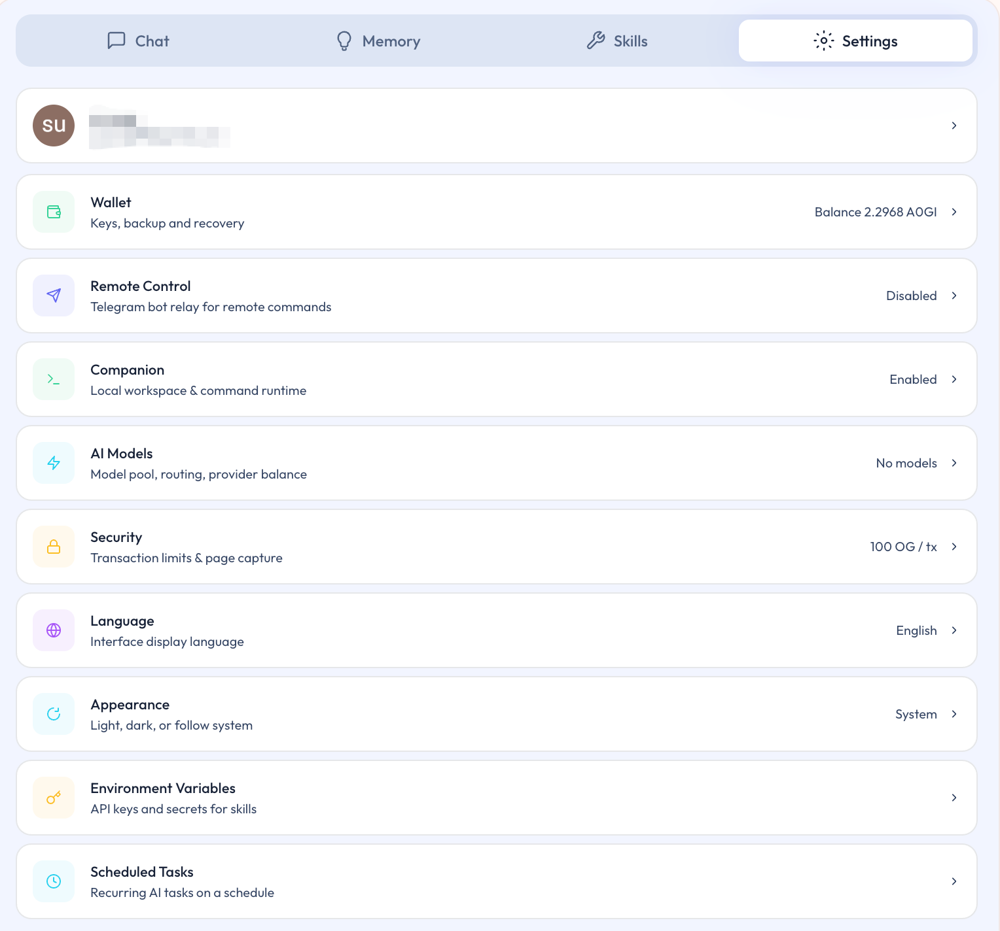

# 设置总览

## 本页说明

Settings 是 Ghast AI 管理能力边界和主要配置的统一入口。本页说明各分类分别负责什么，以及第一次进入时更合适的查看顺序。

## 先把这页理解成什么

Settings 不是单一设置页，而是一组正式配置入口的总目录。

对应界面如下：

*图：Settings 总览页面*

对普通用户来说，这里最重要的价值，不是“把所有设置一次看完”，而是按当前真实需要进入对应分类。

## 第一次进入时，先看哪几类

对大多数用户来说，第一次进入 Settings，更建议优先看这三类：

- Wallet
- AI Models
- Companion

这是因为它们最直接决定 Ghast AI 是否已经进入完整使用路径。

## 各分类该怎么理解

| 分类 | 更适合怎样理解 |
| --- | --- |
| Wallet | 钱包主入口 |
| AI Models | 模型与模型资金入口 |
| Companion | 本地能力入口 |
| Remote | 远程使用入口 |
| Security | 安全边界与默认保护设置 |
| Language / Appearance | 语言与显示设置 |
| Env Vars | 更深入本地能力相关设置 |
| Scheduled Tasks | 定时任务与 Heartbeat 入口 |

## 为什么不需要一次看完所有分类

并不是所有设置都在第一次使用时同等重要。更稳妥的方式是：

1. 先解决当前真正影响使用的问题。
2. 先完成钱包、模型和 Companion 这些主路径设置。
3. 以后有远程、定时任务或更深本地能力需求时，再进入相应分类。

Settings 是 Ghast AI 当前的统一设置入口。对普通用户而言，最适合先从 Wallet、AI Models 和 Companion 三类设置开始，再根据是否需要远程使用、定时任务或更深入本地能力，逐步进入其他分类。

## 相关页面

- [钱包设置](wallet-setup.md)
- [选择模型与充值](models-and-funding.md)
- [安装与自动配对](../companion/install-and-auto-pair.md)
- [安全概览](../security/overview.md)
