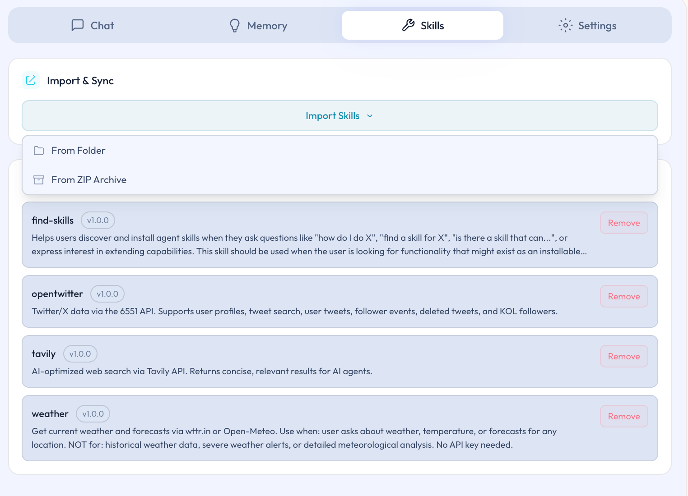

# Skills 页面

## 本页说明

Skills 页面是 Ghast AI 管理技能的标准入口。本页说明这页适合做什么、第一次进入时该怎么开始，以及什么时候才需要继续关心更深的本地支持条件。

## 这页主要负责什么

对普通用户来说，Skills 页面主要负责三件事：

- 查看当前已经安装了哪些技能。
- 从本地文件夹或 ZIP 导入新技能。
- 删除不再需要的技能，并整理当前技能列表。

对应界面如下：

*图：Skills 页面*

这页的定位，是技能管理入口，而不是第一次上手时必须全部配置完的页面。

## 第一次使用时怎么开始

更稳妥的做法通常是：

1. 先看当前已经装了哪些技能。
2. 先导入一小批你真正会用到的技能。
3. 先用一段时间，再决定是否继续增加新的技能。

这样更容易保持使用路径清晰，而不是一开始就把技能堆得过多。

## 技能导入后，为什么有时还不能完整工作

并不是所有技能都只靠导入就能完整运行。

更适合的理解方式是：

- 有些技能导入后就能直接使用。
- 有些技能还会依赖 Companion 或更深的本地工具支持。
- 如果你还没有进入本地能力路径，就不需要急着把这部分一次补齐。

## 这页不适合怎么用

为了保持手册路径清晰，建议避免下面这些做法：

- 不要把 Skills 页面当成第一次安装后的必经配置大页。
- 不要一次导入大量来源不明、当前也用不到的技能。
- 不要在技能尚未真正进入日常使用前，就先扩张过多本地能力边界。

Skills 页面是 Ghast AI 当前管理技能的主入口。对普通用户而言，推荐从少量、明确有用的技能开始使用，并在确认某个技能确实需要更深本地支持时，再继续补齐 Companion 或 MCP 等相关条件。

## 相关页面

- [Skills 与 MCP 模型](../core-concepts/skills-and-mcp.md)
- [MCP Servers](../companion/mcp-servers.md)
- [设置总览](settings-overview.md)
