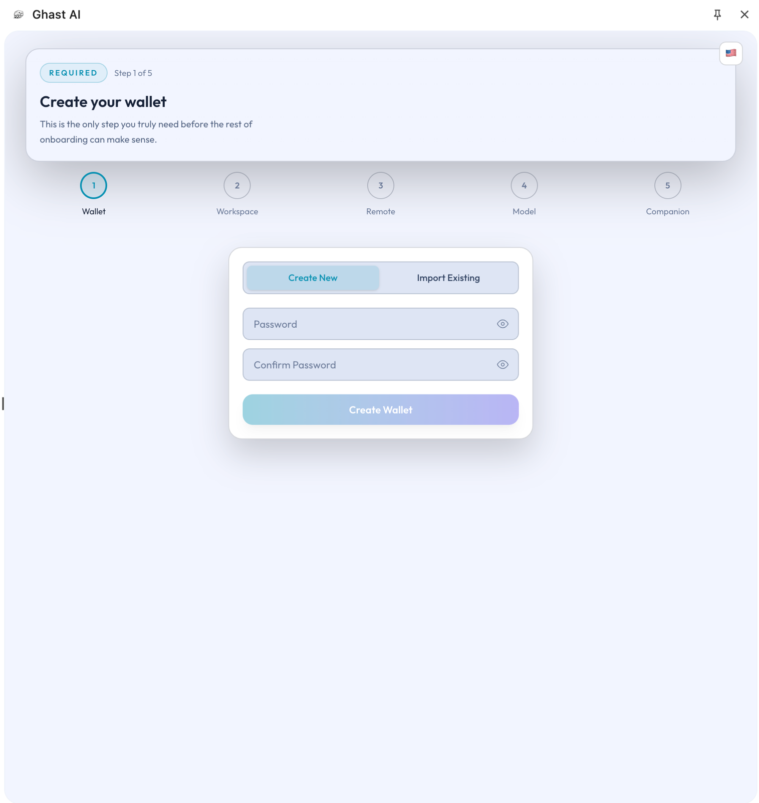

# 钱包设置

## 本页说明

本页说明在 Ghast AI 中如何完成钱包设置，以及第一次使用时应该怎样理解创建、导入、解锁和自动上锁这些操作。

## 第一次进入这页时，你通常要做什么

对大多数用户来说，钱包设置的第一步只有两种选择：

- 创建一个新钱包
- 导入一个已有钱包

对应界面如下：

*图：钱包创建与导入界面*

如果你只是第一次开始使用 Ghast AI，只需要先完成其中一种，不必一开始就处理导出、自动上锁细节和所有高级管理动作。

## 创建和导入该怎么选

### 创建新钱包

适合还没有现成钱包，或者希望把 Ghast AI 使用路径与现有钱包分开管理的情况。

### 导入已有钱包

适合已经有明确使用中的钱包，并希望继续沿用现有资产与账户习惯的情况。

无论选择哪一种，当前都建议把它理解成“为 Ghast AI 建立本地钱包入口”，而不是一次性做完整钱包管理迁移。

## 解锁和锁定该怎么理解

钱包并不是设置完就长期开放使用的。

更适合的理解方式是：

- 解锁是为了当前使用阶段打开钱包能力。
- 锁定是把钱包重新收回到更安全状态。
- 自动上锁是帮助你减少长期暴露风险的默认保护。

对普通用户来说，保留默认自动上锁通常就是更稳妥的选择。

## 导出相关能力什么时候再看

页面中虽然也提供导出相关能力，但这不属于第一次使用时的重点。

更推荐的顺序是：

1. 先完成创建或导入。
2. 先用钱包完成基础使用路径。
3. 只有在明确需要时，再去处理导出类操作。

## 这页和 Companion 的关系

即使你已经安装 Companion，钱包边界仍然主要在扩展这一侧。

对普通用户来说，可以直接记住：钱包设置仍然主要在这里完成，而不是在 Companion 里完成。

钱包设置页是 Ghast AI 当前的钱包主入口。对普通用户而言，第一次使用时只需要先完成创建或导入，再保持默认自动上锁即可；导出和更深入的钱包管理，应在明确需要时再处理。

## 相关页面

- [钱包密钥处理](../security/wallet-key-handling.md)
- [钱包与模型充值](../core-concepts/wallet-and-funding.md)
- [钱包与充值问题](../troubleshooting/wallet-and-funding.md)
